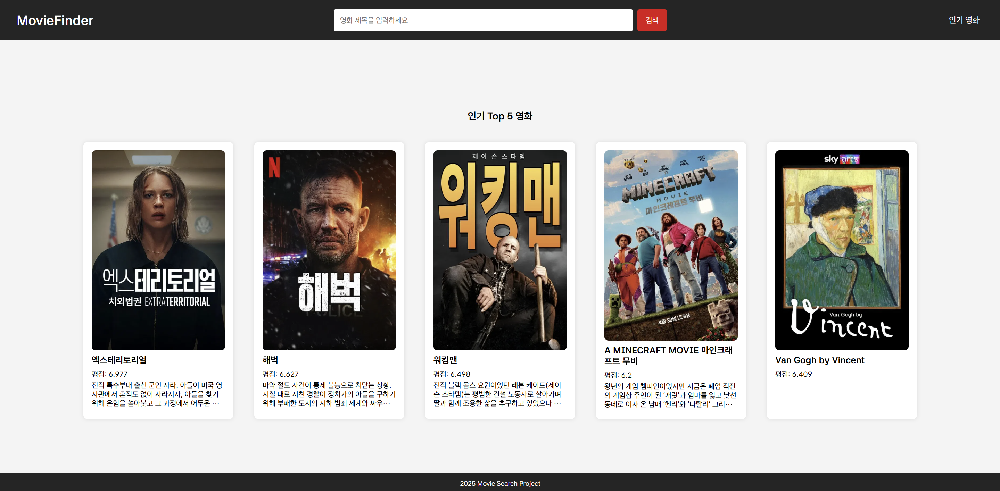
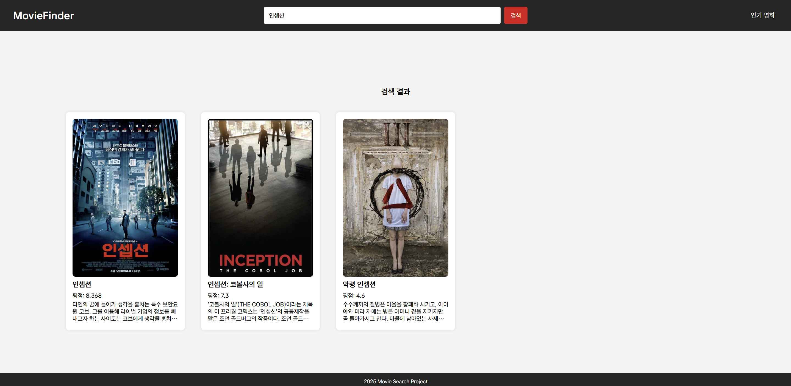
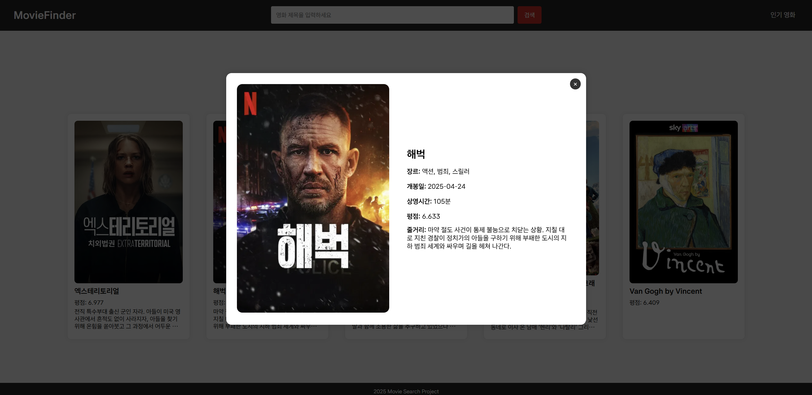

# fe-no1-assignment

카카오테크캠퍼스 1단계 1차 과제

- **진짜 영화 정보**를 제공하는 검색 사이트 만들기
- **HTML**, **CSS**, **JavaScript**만으로 API와 소통하며 웹 애플리케이션 만들기
- 영화 팬들을 위한 **멋진 UI**로, 데이터를 시각적으로 표현하기
- 🦸‍♂️ API 마스터: 개발자가 되는 첫 걸음으로 실시간 데이터를 사용하는 법 익히기!

## 필수 기능

1. **TMDB API 연동**

   - TMDB API에서 데이터를 **`fetch` API**로 가져오고, API 키를 통해 데이터 요청을 처리하세요. 데이터를 받아와서 콘솔에서 출력해 확인합니다.
   - **중요 포인트**: API 키를 적절히 보관하고, API 호출 시 **정확한 경로**와 파라미터를 사용하도록 하세요.

2. **영화 카드 리스트 UI 구현**
   - 영화 포스터, 제목, 평점, 요약 등의 정보를 포함한 영화 카드 리스트 UI를 HTML과 CSS로 구현하세요.
3. **영화 검색 기능**
   - 사용자가 입력한 검색어로 영화 목록을 필터링하는 검색 기능을 구현하세요. **검색어 입력 후 버튼 클릭으로 검색을 실행**하게 만드세요
   - **중요 포인트**: 검색어와 관련된 영화만 화면에 나타나도록 필터링 로직을 제대로 구현해야 합니다.
4. **영화 상세 모달 구현**
   - 각 영화 카드를 클릭했을 때, 해당 영화의 ID로 TMDB API에서 **상세 정보를 받아와** 화면에 표시하세요.
   - **중요 포인트**: **모달**로 영화 상세 정보를 표시하고, **뒤로 가기** 기능도 구현합니다.

